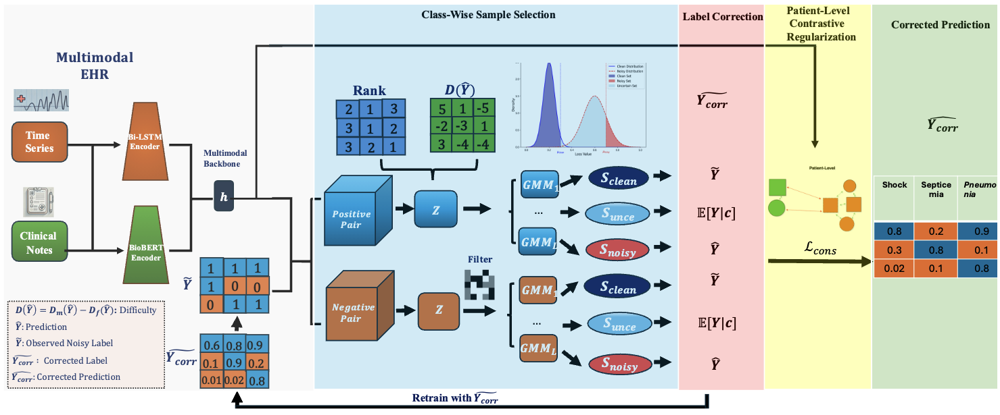

# MIRACL: A Robust Multi-Label Learning Framework on Noisy Multimodal Electronic Health Records
This is the formal implementation of our paper: "MIRACL: A Robust Multi-Label Learning Framework on Noisy Multimodal Electronic Health Records".

## Abstracts
Multimodal Electronic Health Records (EHRs), comprising structured time-series data and unstructured clinical notes, offer complementary views of patient health. However, multi-label prediction tasks on multimodal EHR data, such as phenotyping, are hindered by potential label noise, including false positives and negatives. Existing noisy-label learning methods, often designed for single-label vision data, fail to capture real label-dependencies or account for the cross-modal, longitudinal nature of EHRs.
To address this, we propose MIRACL (\textbf{M}ultimodal \textbf{I}nstance \textbf{R}elabelling \textbf{A}nd \textbf{C}orrection for multi-\textbf{L}abel noise (MIRACL\footnote{\url{https://github.com/anon-coder-def/MIRACL }}), a novel framework that systematically addresses these challenges.  Notably, MIRACL is the first framework designed to explicitly leverage longitudinal patient context to resolve more challenging multi-label noise scenarios. To achieve this, MIRACL unifies three synergistic mechanisms:
(1) a difficulty- and rank-based metric for robust identification of noisy instance-label pairs, 
(2) a class-aware correction module for robust label refinements, promoting the recovery of real label-dependencies, and
(3) a patient-level contrastive regularization loss that leverages both cross-modal and longitudinal patient context to correct for noisy supervision across different visits.
Extensive experiments on large-scale multimodal EHR datasets (MIMIC-III/IV) demonstrate that MIRACL achieves state-of-the-art robustness, improving test mAP by over 2\% under various noise levels.

<div align="center">

</div>

## Data Download
### MIMIC-IV data
For all MIMIC datasets, you need to get download access from physionet.org first before proceeding:
#### Download Link
[MIMIC-IV 2.0](https://physionet.org/content/mimiciv/2.0/), 
[MIMIC-IV-NOTE 2.2](https://physionet.org/content/mimic-iv-note/2.2/)
We follow the same pre-processing procedure as FlexCare, except for removing image feature (MIMIC-CXR-JPG) from our analysis. Please refer to https://github.com/mhxu1998/FlexCare/tree/main For required data format.

### MIMIC-III data
#### Download Link
[MIMIC-III 1.4](https://physionet.org/content/mimiciii/1.4/)

## Data Preprocessing
### MIMIC-IV data: 
Please refer to REAME.md under mimic4extract directory
### MIMIC-III data: 
Please refer to REAME.md under mimic3extract directory

## Requirements
This project is run in a conda virtual environment on CUDA 11.1. 
+ torch==1.10.1+cu111
+ Python==3.7.9
+ transformers==4.30.2
+ tokenizers==0.13.3
+ huggingface-hub==0.16.4

## Usage
To train MIRACL on MIMIC-IV PHE, DIA and MIMIC-III PHE datasets mentioned in this paper, run
### MIMIC-IV PHE
```bash
nohup python main_mt_test_main.py --data_path data --ehr_path data/ehr --task phenotyping --epochs 30 --lr 0.001 --dataset mimic4 --model MIRACL  --device 0 --seed 30 --warmup 5 --corr --LocalGMM --nbins 25 --noise_ratio 0.2,0.2 --noise_type Asym --criterion BCE
```

### MIMIC-III PHE
```bash
nohup python main_mt_test_main.py --data_path newdata --ehr_path newdata/ehr --task phenotyping --epochs 30 --lr 0.001 --dataset mimic3 --model MIRACL  --device 0 --seed 30 --warmup 5 --corr --LocalGMM --nbins 25 --noise_ratio 0.2,0.2 --noise_type Asym --criterion BCE
```

### MIMIC-IV DIA
```bash
nohup python main_mt_test_main.py --data_path data --ehr_path data/ehr --task diagnosis --dataset mimic4 --epochs 30 --lr 0.001 --model MIRACL  --device 0 --seed 30 --warmup 5 --corr --LocalGMM --nbins 14 --noise_ratio 0.2,0.2 --noise_type Asym --criterion BCE 
```
The results are put in ```./log/```. 


## Acknowledgement
We adapted the following open-source code to implement the state-of-the-art algorithms
* [ASL](https://github.com/Alibaba-MIIL/ASL)
* [GCE](https://github.com/AlanChou/Truncated-Loss)
* [FlexCare](https://github.com/mhxu1998/FlexCare/tree/main)
* [MedFuse](https://github.com/nyuad-cai/MedFuse)
* [MultiT](https://github.com/tmllab/2022_NeurIPS_Multi-Label-T) 


## Appendix
Check out our supplementary material inside our repository as well: Appendix_MIRACL.pdf